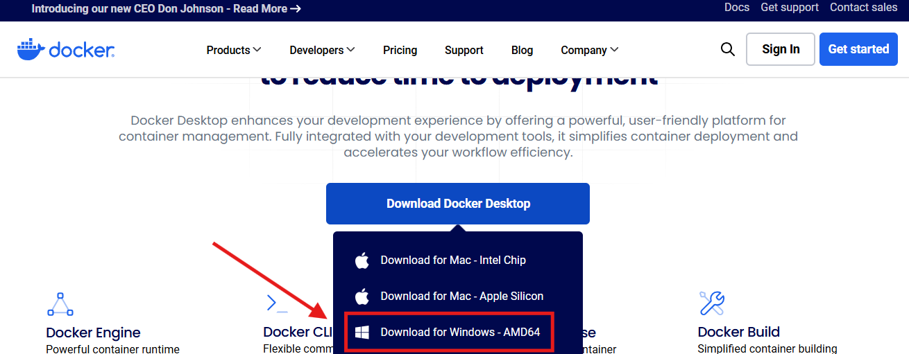
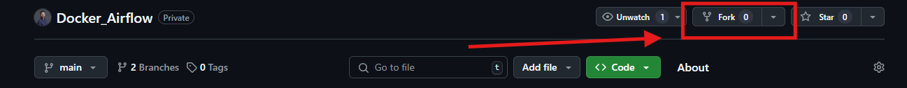
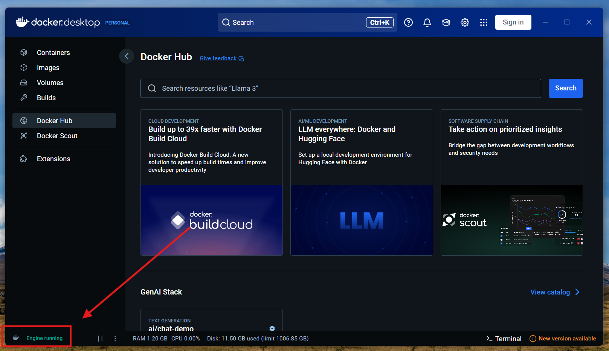
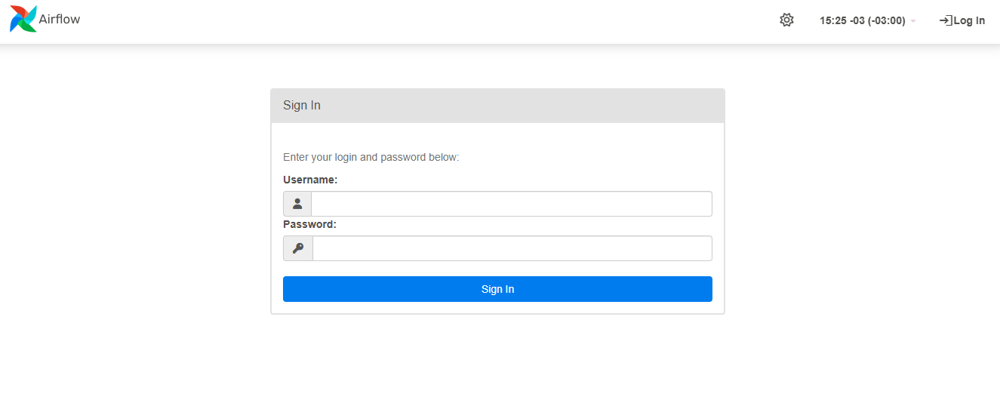
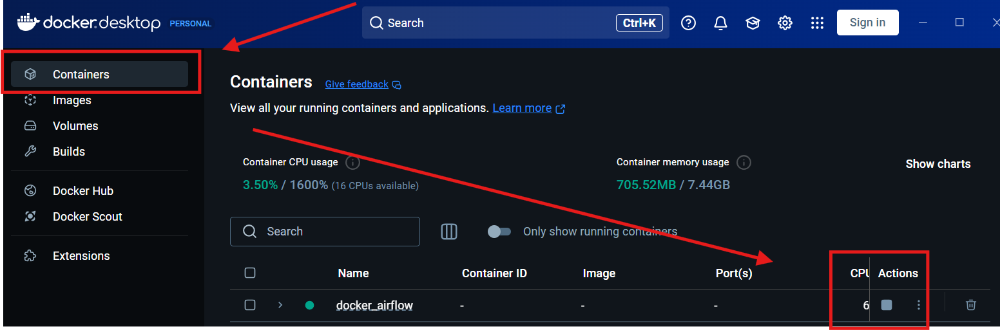
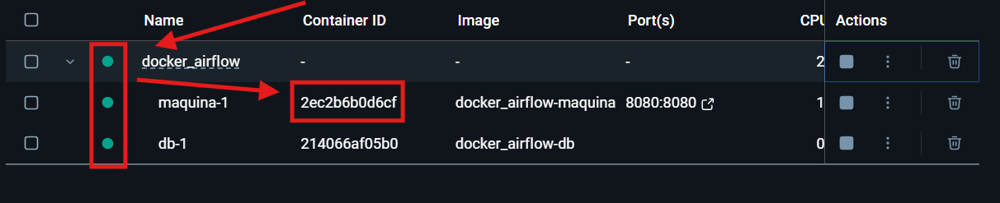

# Docker & Airflow

Este repositório é dedicado ao deploy simplificado de uma aplicação Apache Airflow, utilizando a tecnologia de conteinerização Docker.

## Índice

- [Propósito](#propósito-deste-repositório)
- [Airflow - Introdução](#airflow---introdução-à-ferramenta)
- [Docker - Introdução](#docker---contêineres)
- [Conteúdo Deste Repositório](#conteúdo-deste-repositório)
- [Conhecimentos Necessários](#conhecimentos-necessários)
- [Instalação - Windows](#instalação---windows)
- [Instalação - Linux](#instalação---linux)
- [Configurações Iniciais](#configurações-iniciais)
- [Modo de Uso](#modo-de-uso)


## Propósito Deste Repositório

Esta Repo tem como propósito facilitar o acesso para uso educacional à plataforma Apache Airflow. 

Este software é muito utilizado pela comunidade de dados devido à sua facilidade para automatizar a execução de scripts python e orquestrar pipelines de dados. 

Uma dificuldade associada a esta ferramenta, porém, está relacionada ao seu setup inicial. Como se trata de uma ferramenta open-source e com a instalação baseada em sistemas linux, podem ocorrer diversos problemas durante a instalação e configuração dos serviços, cuja solução não é amigável ao usuário que não possui familiaridade com sistemas linux, comandos em bash, configurações básicas e conexão com bases de dados relacionais (SQLite, Postgres, Mysql, dentre outras).

Neste sentido, o propósito desta Repo consiste em fornecer um acesso fácil à instalação desta ferramenta através do uso de containeres Docker. Com a conteinerização, o deploy desta aplicação é facilitado substancialmente, permitindo o uso e aprendizado por parte do usuário mais iniciante, que pode dedicar seu foco e energia iniciais no entendimento da própria ferramenta.


## Airflow - Introdução à Ferramenta

A execução automatizada e orquestrada de tasks é essencial para garantir eficiência, escalabilidade e confiabilidade em processos de dados e workflows complexos. 

Nesse contexto, o Apache Airflow se destaca como uma ferramenta poderosa para orquestração de workflows, oferecendo uma interface flexível para definir, monitorar e gerenciar pipelines de dados. Com suporte a dependências entre tasks, agendamento dinâmico e escalabilidade, o Airflow tem se tornado uma escolha popular entre usuários de dados para a orquestração de seus pipelines.


## Docker - Contêineres

O Docker Engine, por sua vez, se trata de uma ferramenta open source para a conteinerização de aplicações, podendo ser utilizado em várias áreas do TI, como frontend, backend, Infraestrutura e Dados.

Um conteiner consiste no empacotamento de uma aplicação e todas as suas dependências em uma unidade padrão para reprodução. Ele auxilia na hora de padronizar o deploy de aplicativos, uma vez que roda da mesma forma independente do sistema que seja realizado o deploy, permitindo que rodemos o nosso app de maneira leve, rápida e padronizada.

Esta repo pode ser considerada um bom exemplo de conteiner, onde desejamos rodar as funcionalidades básicas do Apache Airflow (Scheduler e Webserver) de maneira rápida e fácil, sem maiores preocupações com setup.


## Conteúdo Deste Repositório

Este repositório é composto por 3 pastas, sendo estas:

1. **Database**: Imagem Docker e arquivos necessários para montagem da base de dados PostgresSQL necessária para o funcionamento do airflow.

2. **Linux**: Imagem Docker e arquvios necessários para a montagem do ambiente linux e instalação de dependências necessárias para o funcionamento do airflow.

3. **Airflow Files**: Pastas locais para inserção de arquivos a serem utilizados pelo airflow. Nelas, foram pré-definidos os espaços para dags, bibliotecas de usuário e arquivos com credenciais. Seu funcionamento e uso será explicado posteriormente.

4. **Images**: Pasta contendo as imagens utilizadas nesta repo. Ela não é necessária para a instalação do Apache Airflow.


## Conhecimentos Necessários

É esperado que, para utilizar esta solução, o usuário possua conhecimentos básicos em **git**, **github** e **execução de comandos no prompt** do sistema operacional.


## Instalação - Windows

Para a instalação no sistema operacional Windows, o usuário deve seguir os seguintes passos:

1.**Realize o Download e Instalação da Docker Engine:**

Para que possamos montar imagens Docker, precisamos baixar a sua engine, que pode ser obtida neste [link](https://www.docker.com/products/docker-desktop/).

- OBS: O link e layout do website podem mudar com o tempo. Garanta que está baixando a distribuição do Docker do website oficial da empresa.



2.**Crie uma fork deste projeto para seu próprio ambiente Github.**



3.**Baixe o repositório para seu ambiente local.**

4.**Abra o Prompt de Comando e Localize-o na pasta desta repo.**

Após abrir o CMD, você deve movê-lo para pasta correta com o seguinte commando:

   ```bash
   cd <caminho/para/a/pasta/da/repo>
   ```

5.**Inicie o progama Docker Desktop**

Após a inicialização, é importante aguardar que a a docker engine inicie. No momento da disponibilização desta repo, isto pode ser verificado no canto inferior esquerdo da aplicação.



6.**Realize o Build da Aplicação**

Para isso, será necessário inserir o seguinte comando no CMD.

   ```bash
   docker compose up
   ```

Aguarde a instalação das dependências e montagem das ./Images/imagens (pode levar alguns minutos dependendo da capacidade de sua máquina) e pronto! Você já deve ter em mãos uma aplicação multiconteiner do airflow, rodando.

7.**Teste sua Instalação**

O airflow, por padrão, pode ser acessado a partir da porta "8080" do localhost. Acesse o link e confira se é apresentada a tela de login da ferramenta.

    http://localhost:8080

Caso veja uma tela semelhante com a figura abaixo, parabéns! Sua instalação do Apache Airflow está completa!



- **Observações:**
    - Esta build de Airflow está configurada para ser inicializada toda vez que a docker engine for desligada, caso não deseje isto, você pode executar o comando pause nos conteineres.
    - Da mesma forma, caso os mesmos não religuem de maneira automática, podem ser iniciados da mesma forma.
    - Uma dica para inicialização automática, seria configurar para que o programa Docker Desktop seja iniciado junto com o Windows. Isso fará com que seu Airflow também inicie automáticamente com a ativação de sua máquina.




## Instalação - Linux

Para a instalação no sistema operacional Windows, o usuário deve seguir os seguintes passos:

1.**Realize o Download e Instalação da Docke Engine:**

Para que possamos montar imagens Docker, precisamos executar alguns comandos no bash da máquina ubuntu:

- OBS: Os comandos abaixo foram copiados da documentação oficial da Docker no momento, é recomendado que você verifique se os mesmos continuam válidos no momento de sua instalação. Isso pode ser feito consultando a [documentação oficial](https://docs.docker.com/engine/install/ubuntu/).

Primeiramente, iremos adicionar o Docker à lista de pacotes do ubuntu:

   ```bash
      # Update na lista de pacotes
      sudo apt-get update

      ##Adiciona pacote curl e ca-certificates
      sudo apt-get install ca-certificates curl

      sudo install -m 0755 -d /etc/apt/keyrings

      ##Busca chave GPG oficial da Docker
      sudo curl -fsSL https://download.docker.com/linux/ubuntu/gpg -o /etc/apt/keyrings/docker.asc

      ##Modifica permissões do arquivo
      sudo chmod a+r /etc/apt/keyrings/docker.asc

      ##Adiciona o pacote docker
      echo \
      "deb [arch=$(dpkg --print-architecture) signed-by=/etc/apt/keyrings/docker.asc] https://download.docker.com/linux/ubuntu \
      $(. /etc/os-release && echo "${UBUNTU_CODENAME:-$VERSION_CODENAME}") stable" | \
      sudo tee /etc/apt/sources.list.d/docker.list > /dev/null

      ##Update no pacote
      sudo apt-get update
   ```
Agora, iremos proceder com a instalação dos pacotes necessários


   ```bash
      sudo apt-get install docker-ce docker-ce-cli containerd.io docker-buildx-plugin docker-compose-plugin
   ```

Por fim, podemos testar nossa instalação, rodando um container de "Hello World!"
   ```bash
      sudo docker run hello-world
   ```

Ao executar este comando, você deve receber uma mensagem no prompt semelhante à exibida abaixo: 

   ```bash
      Hello from Docker!
      This message shows that your installation appears to be working correctly.
   ```

Caso tudo esteja correto, podemos prosseguir para os próximos passos da instalação.

2.**Crie uma fork deste projeto para seu próprio ambiente Github.**


3.**Baixe o repositório para seu ambiente local.**

4.**Abra o Prompt de Comando e Localize-o na pasta desta repo.**

Após abrir o CMD, você deve movê-lo para pasta correta com o seguinte commando:

   ```bash
   cd <caminho/para/a/pasta/da/repo>
   ```

5.**Realize o Build da Aplicação**

Para isso, será necessário inserir o seguinte comando no CMD.

   ```bash
   docker compose up
   ```

Aguarde a instalação das dependências e montagem das ./Images/imagens (pode levar alguns minutos dependendo da capacidade de sua máquina) e pronto! Você já deve ter em mãos uma aplicação multiconteiner do airflow, rodando.

6.**Teste sua Instalação**

O airflow, por padrão, pode ser acessado a partir da porta "8080" do localhost ou Ip de sua máquina (Caso esteja utilizando uma instância EC2 ou máquina virtual). Acesse o link e confira se é apresentada a tela de login da ferramenta.

    http://<SEU_IP>:8080

Caso veja uma tela semelhante com a figura abaixo, parabéns! Sua instalação do Apache Airflow está completa!


- **Observações:**
   
   Uma dica para inicialização automática, seria adicionar o comando abaixo ao arquivo crontab do ubuntu, garantindo que sua aplicação será iniciada toda a vez que a máquina for ligada. 

   ```bash
      @reboot nohup docker compose -f caminho/para/seu/arquivo/compose.yaml up
   ```
     
     
   Para acessar o arquivo crontab, você pode utilizar o seguinte comando:

   ```bash
      crontab -e
   ```
   Após editado o arquivo, salve-o. Com isso, sua aplicação deve ser ativada junto com a inicialização de sua máquina/instância.

## Configurações Iniciais

Antes de utilizar o Apache Airflow, ainda é necessário realizar as configurações iniciais, sendo elas:

1.**Criação de Usuário e Senha**

É necessária a criação de pelo menos um usuário, para isso, precisaremos acessar o conteiner ubuntu de nossa aplicação.

Primeiramente, garanta que o seu conteiner esteja ligado e, após isso, anote o "Container ID" do aplicação de nome "maquina-1".



- OBS: Caso esteja rodando o container em uma máquina linux, este id pode ser obtido utilizando o comando abaixo.

   ```bash
      docker container ls -a
   ```

Busque o id relativo ao container de nome "maquina-1". 

Com este valor, insira abra o CMD e execute o seguinte comando: 

   ```bash
      docker exec -it <insira_o_container_id_aqui> bash
   ```

- OBS: Caso esteja utilizando uma instância Linux, será necessário inicializar seu container utilizando o comando:

   ```bash
      docker container start <insira_o_container_id_aqui> 
   ```

Após isso, o texto à esquerda do seu comando deve mudar, indicando que você está agora no prompt de comando do sistema ubuntu dentro do container.

Agora, execute o seguinte comando abaixo para criar seu usuário e senha:

   ```bash
   airflow users create -r Admin -u <nome_de_usuário_aqui> -e admin@example.com -f admin -l user -p <senha_aqui>
   ```

Caso os passos acima sejam executados de maneira correta, você deve receber uma mensagem de confirmação da criação do usuário no prompt.

Teste o novo acesso tentando inserir o novo login e senha na ferramenta. Caso tudo esteja correto, você será direcionado ao painel de controle do Airflow.

## Modo de Uso

Após a instalação, é necessário seguir dois passos para o uso da ferramenta.

1.**Inserção de Dags, Bibliotecas e Credenciais na Pasta Local**

Este deploy é pensado de modo que, uma vez instalado, o usuário não precise mais acessar o ambiente docker. Para isso, iremos inserir os arquivos necessários nas pastas já mapeadas em nosso sistema (mapeamento este que é realizado de forma automática na montagem da imagem).

Foram configuradas 3 pastas de maneira default, as quais se encontram dentro da pasta "Airflow_Files", nesta Repo:

- **Dags:** Nesta pasta, o usuário deverá inserir todas as DAGs a serem executadas pelo airflow, as quais irão aparecer de maneira síncrona na plataforma.

- **Libs:** (Opcional): Esta pasta é de uso opcional por parte do usuário e foi pensada para que o usuário possa adicionar suas bibliotecas customizadas dentro do ambiente de instalação, para uso por parte das DAGs.

- **Credentials:** (Opcional): Esta pasta é de uso opcional por parte do usuário e foi pensada para que o usuário possa adicionar suas credenciais dentro do ambiente de instalação, para uso por parte das DAGs.


2.**Login na WebPage e Execução das Dags**

Uma vez realizadas todas as configurações necessárias, o usuário poderá realizar o login na webpage da aplicação e observar a execução de suas DAGs. Esta webpage pode ser acessada no seguinte link.

    http://localhost:8080